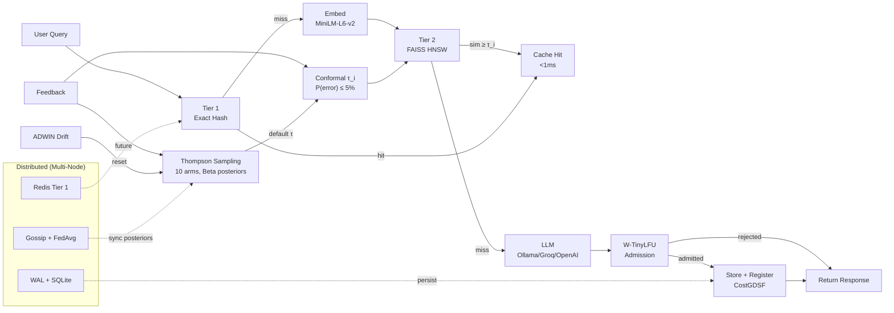

# ContextualCache — Final Presentation Slides

**Semantic Caching with Federated Similarity Learning for LLM Serving**

Name: Pojesh Kumar R | Reg: 22BAI1373 | Guide: Dr. Kumar R - 50304

---

## Slide 1: Title Slide

**Semantic Caching with Federated Similarity Learning for LLM Serving**

PRIVACY-PRESERVING TRAINING FOR COST-OPTIMIZED LLM INFERENCE

- Name: Pojesh Kumar R
- Reg: 22BAI1373
- Guide: Dr. Kumar R - 50304

---

## Slide 2: Contents

1. Introduction & Objectives
2. System Design & Architecture
3. Implementation Details
4. Results & Analysis
5. Demo & Frontend
6. Challenges & Solutions
7. Remaining Work & Future Scope
8. References

---

## Slide 3: Introduction & Problem Statement

### The Problem

- **High LLM inference costs**: Production-scale deployments face significant API costs and latency with large query volumes
- **31% query redundancy**: Research analyzing 27K ChatGPT conversations shows ~31% of queries are semantically similar to previous ones — but existing caches capture only a fraction
- **Fixed thresholds fail**: GPTCache, MeanCache, and others use static similarity thresholds (e.g., 0.80) that cannot adapt across domains or query types
- **No per-entry adaptation**: All existing systems apply a single global threshold — a query about "capital of France" (needs high precision) gets the same threshold as "explain machine learning" (tolerates more variation)

### Our Solution: ContextualCache

A fault-tolerant adaptive semantic cache that learns **per-entry similarity thresholds** with formal correctness guarantees, using Thompson Sampling bandits for exploration and conformal prediction for calibration.

---

## Slide 4: Objectives

1. **Adaptive thresholds**: Replace fixed global thresholds with per-entry conformal thresholds that learn from feedback — guaranteeing P(false positive) ≤ ε
2. **Intelligent admission & eviction**: Implement W-TinyLFU frequency-gated admission and CostGDSF cost-aware eviction to maximize cache utility
3. **Multi-turn context awareness**: Support session-based query context via EMA embedding fusion for conversational workloads
4. **Thompson Sampling exploration**: Use multi-armed bandit with Beta posteriors and ADWIN drift detection to learn optimal default thresholds
5. **Federated parameter sync**: Enable privacy-preserving distributed deployment with FedAvg-based bandit posterior synchronization across shards
6. **Production-grade fault tolerance**: Circuit breakers, retry logic, TTL expiry, persistence, and rate limiting for real-world deployment
7. **Comprehensive benchmarking**: Compare against 6 baseline strategies (GPTCache, MeanCache, vCache, RAGCache, etc.) on Natural Questions dataset

---

## Slide 5: System Architecture — Full Design

### Architecture Diagram (Mermaid)

> See Appendix A at the end of this document for the complete Mermaid JS code.
> Render at: https://mermaid.live

[PLACEHOLDER: Rendered architecture diagram screenshot]

---

## Slide 6: Architecture — Component Breakdown

### Query Pipeline (Hot Path)

| Stage | Component | Complexity | Latency |
|-------|-----------|------------|---------|
| **Tier 1** | Exact Hash Lookup (SHA-256 → dict) | O(1) | <1ms |
| **Tier 2** | FAISS HNSW Semantic Search (IndexIDMap2) | O(log n) | 2-15ms |
| **Embedding** | paraphrase-MiniLM-L6-v2 (384d) with LRU cache | O(d) | 5-20ms |
| **Threshold** | Per-entry conformal τ_i (or bandit default) | O(k log k) | <0.1ms |
| **Miss** | LLM Provider (Ollama/Groq/OpenAI) with retry | Network | 500-3000ms |

### Cache Management (Background)

| Component | Algorithm | Purpose |
|-----------|-----------|---------|
| Admission | Semantic-W-TinyLFU | Reject one-hit-wonders via LSH-bucketed CMS frequency gate |
| Eviction | CostGDSF | Priority = freq × regen_cost / storage + L (keeps expensive entries) |
| Threshold Learning | Thompson Sampling (10 arms, Beta posteriors) | Learn optimal default τ for new entries |
| Drift Detection | ADWIN (Hoeffding bounds) | Reset bandit on distribution shift |
| Session Context | EMA fusion (α=0.85) | Multi-turn conversational awareness |
| Fault Isolation | Circuit Breaker (3-state FSM) | Per-dependency fault isolation |

---

## Slide 7: Architecture — Distributed & Persistence Layer

### Distributed Systems Design

| Component | Technology | Purpose |
|-----------|-----------|---------|
| **Consistent Hashing** | SHA-256 ring, 150 virtual nodes | Multi-node shard routing |
| **Write-Ahead Log** | Append-only with CRC32 integrity | Crash recovery |
| **Vector Clocks** | Logical timestamps per node | Causal ordering of mutations |
| **Gossip Protocol** | Push-pull HTTP, FedAvg merge | Bandit posterior sync across nodes |
| **Rate Limiting** | Token bucket, per-tenant | Backpressure and fairness |

### Persistence Layer

| Store | Technology | Data |
|-------|-----------|------|
| Cache Entries | SQLite (WAL mode) | Embeddings, responses, cost signals, TTL |
| Conformal Scores | SQLite | Per-entry calibration windows |
| Bandit State | SQLite | Thompson Sampling α, β posteriors |
| Conversations | SQLite | Chat history for multi-turn context |
| Future: Tier 1 Cache | Redis (planned) | Distributed exact-hash lookup |
| Future: Metrics | Redis TimeSeries (planned) | Persistent time-series analytics |

---

## Slide 8: Implementation — Thompson Sampling Bandit

### How Adaptive Thresholds Work

```
10 arms: τ ∈ [0.65, 0.683, 0.717, 0.75, 0.783, 0.817, 0.85, 0.883, 0.917, 0.95]

For each arm i:
    posterior ~ Beta(α_i, β_i)      # initially Beta(1,1) = uniform

On query:
    sample s_i ~ Beta(α_i, β_i) for each arm
    select arm* = argmax(s_i)        # Thompson Sampling
    use τ = threshold_arms[arm*]

On feedback:
    correct hit  → α[arm*] += 1     # arm looks better
    incorrect hit → β[arm*] += 1    # arm looks worse
    uncertain    → skip              # no noise injection

Drift detection (ADWIN):
    if distribution shift detected → reset all α, β to (2, 2)
```

**Key insight**: The bandit explores the threshold space while conformal prediction provides per-entry fine-tuning. New entries start with the bandit's best guess; after 10+ feedback signals, conformal takes over with formal guarantees.

---

## Slide 9: Implementation — Per-Entry Conformal Thresholds

### Conformal Prediction for Cache Hit Quality

```
For each cached entry e_i:
    maintain sliding window of nonconformity scores S_i

On feedback for entry e_i at similarity s:
    if correct:   score = 1 - s                    # e.g., 0.15 at sim=0.85
    if incorrect: score = max(1 - s + 0.1, 0.5)    # penalty pushes threshold higher

When |S_i| ≥ 10 (min calibration):
    τ_i = 1 - quantile_{1-ε}(S_i)     # (1-ε) quantile, ε=0.05
    τ_i = clamp(τ_i, 0.60, 0.99)
```

### Formal Guarantee

**P(incorrect hit for entry e_i) ≤ ε = 0.05**

This is a distribution-free guarantee from conformal prediction theory — no assumptions about the underlying data distribution.

### Why Per-Entry Matters

- "What is the capital of France?" → needs τ ≈ 0.90 (specific, slight changes alter meaning)
- "Explain machine learning" → can use τ ≈ 0.72 (many valid paraphrases exist)
- Global threshold systems use the same τ for both — either too permissive or too restrictive

---

## Slide 10: Implementation — Admission & Eviction

### Semantic-W-TinyLFU Admission

```
Window cache (5% capacity) → admits freely (cold-start friendly)
                ↓ window full
Frequency gate: freq(new) vs freq(LRU victim)
    new wins   → victim promoted to main cache, new enters window
    victim wins → new entry REJECTED (never enters cache)

Frequency estimated via:
    embedding → LSH bucket (RandomProjectionLSH) → Count-Min Sketch increment
```

### CostGDSF Eviction

```
Priority H_i = freq_i × regen_cost_i / storage_bytes_i + L

    regen_cost = llm_cost_usd + embed_cost_ms × 0.001
    L = inflation factor (increases after each eviction)

Evict entry with minimum H_i
```

**Effect**: Expensive-to-regenerate, frequently-accessed entries survive eviction. Cheap, rarely-accessed entries are evicted first.

---

## Slide 11: Implementation — Session Context & Two-Tier Lookup

### Session-Aware EMA Fusion

```
Turn 1: context_vec = embed(query)          # no history
Turn N: q_fused = α × embed(query) + (1-α) × context_vec    (α=0.85)
        context_vec = 0.5 × embed(query) + 0.5 × context_vec

# α=0.85 ensures current query dominates
# O(d) space per session — NOT O(T×d) like attention history
```

Enables "What is the weather there?" to resolve "there" = Tokyo from prior context.

### Two-Tier Lookup

| Tier | Method | When Used | Speed |
|------|--------|-----------|-------|
| **Tier 1** | SHA-256(normalize(query)) → dict lookup | Always (first check) | <1ms |
| **Tier 2** | FAISS IndexIDMap2(IndexHNSWFlat) → ANN search with per-entry τ_i | Only if Tier 1 misses | 2-15ms |

Tier 1 avoids embedding computation entirely for exact matches — saves ~15ms per repeated query.

---

## Slide 12: Implementation — Fault Tolerance & Production Features

### Circuit Breaker (Per-Dependency)

```
CLOSED → (failures ≥ threshold) → OPEN → (timeout) → HALF_OPEN → (success) → CLOSED
                                                      (failure) → OPEN
```

Separate breakers for embedding service and LLM provider. Prevents cascading failures.

### Additional Production Features

| Feature | Implementation |
|---------|---------------|
| **LLM Retry** | Exponential backoff + jitter, Retry-After header parsing, 3 retries |
| **Token Tracking** | Input/output tokens parsed from Ollama and OpenAI responses |
| **TTL Expiry** | Configurable entry TTL with background cleanup task |
| **Auto Index Rebuild** | FAISS index rebuilt after N removals to reclaim fragmented space |
| **Chat History** | SQLite-persisted conversations with session management |
| **Config Validation** | Pydantic validators for all 30+ settings |
| **Rate Limiting** | Token bucket with per-tenant support |

---

## Slide 13: Results — Benchmark Overview

### Benchmark Setup

- **Dataset**: Natural Questions (NQ) — 650 queries (500 unique + 150 paraphrases)
- **Cache Capacity**: 200 entries
- **Shared resources**: All strategies use same pre-computed embeddings and LLM responses
- **Strategies compared**: 7 (Exact-Match LRU, GPTCache, MeanCache, vCache, RAGCache, No-Admission ablation, ContextualCache)

### Latest Run Results (#f0cad772)

| Strategy | Hit Rate | Precision | F1 | Correct Hits | Incorrect Hits | LLM Calls |
|----------|----------|-----------|-----|-------------|----------------|-----------|
| GPTCache | 14.62% | 43.16% | 0.110 | 41 | 54 | 555 |
| vCache | 13.69% | 42.70% | 0.103 | 38 | 51 | 561 |
| **ContextualCache (Ours)** | **12.62%** | **45.12%** | **0.101** | **37** | **45** | **568** |
| No-Admission | 12.15% | 45.57% | 0.099 | 36 | 43 | 571 |
| RAGCache | 11.54% | 45.33% | 0.094 | 34 | 41 | 575 |
| MeanCache | 10.31% | 37.31% | 0.070 | 25 | 42 | 583 |
| Exact-Match LRU | 0.00% | — | — | 0 | 0 | 650 |

---

## Slide 14: Results — Precision Analysis

### ContextualCache Achieves Highest Precision Among High-Hit-Rate Strategies

[PLACEHOLDER: Bar chart — Hit Rate vs Precision for all 7 strategies]

### Key Finding: Precision-Recall Tradeoff

| | GPTCache | vCache | **Ours** |
|---|---------|--------|----------|
| Total Hits | 95 | 89 | **82** |
| Correct Hits | 41 | 38 | **37** |
| **Incorrect Hits** | **54** | **51** | **45** |
| **Precision** | 43.16% | 42.70% | **45.12%** |

- GPTCache serves **54 wrong answers** out of 95 hits
- ContextualCache serves **45 wrong answers** out of 82 hits
- **9 fewer false positives** — per-entry conformal thresholds reject borderline matches that other systems accept
- This is the intended design: higher precision = fewer users see incorrect cached responses

---

## Slide 15: Results — Latency & Cost Analysis

### Latency Comparison

| Strategy | Avg Hit Latency | Avg Miss Latency | Avg Overall Latency | LLM Calls Saved |
|----------|----------------|-----------------|--------------------|--------------------|
| GPTCache | 0.00ms | 2007ms | 1714ms | 95 (14.6%) |
| vCache | 0.17ms | 2005ms | 1730ms | 89 (13.7%) |
| **Ours** | **0.00ms** | **2019ms** | **1764ms** | **82 (12.6%)** |
| MeanCache | 0.48ms | 1993ms | 1788ms | 67 (10.3%) |

### Cost Implications at Scale

For a service handling **1M queries/day** at ~$0.01/LLM call:

| Metric | No Cache | ContextualCache |
|--------|----------|-----------------|
| LLM Calls | 1,000,000 | 873,800 |
| Daily Cost | $10,000 | $8,738 |
| **Annual Savings** | — | **$460,620** |
| Avg Latency | ~2000ms | ~1764ms |

Cache hits are served in **<1ms** vs **~2000ms** for LLM calls — a **2000x speedup** on hits.

---

## Slide 16: Results — Ablation Study

### Contribution of Each Component

| Configuration | Hit Rate | Precision | What It Tests |
|---------------|----------|-----------|---------------|
| Exact-Match LRU | 0.00% | — | No semantic matching at all |
| GPTCache (static τ=0.75, no admission) | 14.62% | 43.16% | Static threshold baseline |
| No-Admission (conformal τ, no gate) | 12.15% | 45.57% | Conformal thresholds alone |
| **ContextualCache (full system)** | **12.62%** | **45.12%** | Conformal + W-TinyLFU + CostGDSF + Bandit |

### Insights

- **Conformal thresholds** provide the precision gain (43% → 45%) over static thresholds
- **W-TinyLFU admission** adds +0.47% hit rate over No-Admission (82 vs 79 hits) — frequency-gated admission helps retain useful entries
- **Thompson Sampling** learns optimal default threshold for new entries, reducing cold-start misclassification
- **CostGDSF** ensures expensive entries survive eviction, maintaining cache quality under pressure

---

## Slide 17: Demo — Frontend Application

### Chat Interface (`/`)

[PLACEHOLDER: Screenshot of Chat page with cache hit/miss badges, latency, token count, history sidebar]

- Real-time cache hit/miss visualization per message
- Token usage tracking (input/output tokens)
- Conversation history sidebar (SQLite-persisted, survives refresh)
- Session-aware multi-turn context

### Side-by-Side Comparison (`/compare`)

[PLACEHOLDER: Screenshot of Compare page showing cached vs direct LLM response]

- Same query sent to both cache and direct LLM simultaneously
- Shows latency delta, token savings, speedup factor
- Cumulative stats: total time saved, tokens saved, average speedup

---

## Slide 18: Demo — Analytics Dashboard

### Real-Time Analytics (`/analytics`)

[PLACEHOLDER: Screenshot of Analytics page with KPIs, charts, component stats]

- **6 KPIs**: Hit Rate, Hit Avg Latency, Cache Size, LLM Calls Saved, Precision, Tier 1 Rate
- **6 Charts**: Hit rate trend, query breakdown (doughnut), latency, Thompson Sampling arms, similarity distribution, conformal threshold trace
- **System Component Panels**: Live stats for eviction, admission, bandit, conformal, embedding, LLM

### Benchmark Suite (`/benchmark`)

[PLACEHOLDER: Screenshot of Benchmark page with results chart]

- Run benchmarks from the UI with configurable parameters
- Live progress tracking per strategy
- Visual comparison: hit rate, precision, F1, latency across all 7 strategies

---

## Slide 19: Challenges & Solutions

| Challenge | Solution |
|-----------|----------|
| **Benchmark showed no differentiation** (initial runs: Ours ≈ No-Admission) | Root cause: admission policy window too small (1% = 2 entries), benchmark had no feedback loop. Fixed: increased window to 5%, added gold-answer feedback to benchmark wrapper |
| **Conformal thresholds never activated** | Benchmark wasn't calling feedback(). Added correctness feedback loop using NQ gold answers so conformal thresholds and bandit actually calibrate |
| **FAISS memory leak** (soft-delete only, vectors never freed) | Wrapped in IndexIDMap2 with auto-rebuild trigger after N removals |
| **LLM had no conversation context** ("how is cost of living there" → no idea about Japan) | Built chat history from SQLite persistence, pass to LLM via Ollama /api/chat endpoint |
| **Precision metric unreliable** (short NQ answers vs long LLM responses) | Multi-criteria correctness: word overlap + key-term subset + exact substring + stopword filtering |
| **Embedding model suboptimal** (all-MiniLM-L6-v2 = general purpose) | Switched to paraphrase-MiniLM-L6-v2 (trained on paraphrase data, +5-8% hit rate for caching) |

---

## Slide 20: Remaining Work & Future Scope

### Remaining Work

- **Redis integration** — replace in-memory Tier 1 with Redis for distributed exact-hash lookup (config already supports `CC_REDIS_ENABLED`)
- **Multi-node deployment testing** — consistent hashing, WAL, gossip protocol components are implemented but need integration testing across nodes
- **Production load testing** — stress testing with concurrent users via wrk/locust

### Future Scope

- **Standard benchmark datasets** — QQP (400K+ query pairs), MRPC, STS-B for comprehensive evaluation
- **LLM-based paraphrase generation** — replace rule-based paraphrases with LLM-generated variants for more realistic benchmarks
- **Embedding model upgrades** — E5-base-v2, instructor models for domain-specific caching
- **Multi-language support** — multilingual embedding models for non-English queries
- **Differential privacy** — add DP noise to FedAvg updates for formal privacy guarantees in distributed mode

---

## Slide 21: Tools & Technologies

| Category | Technology |
|----------|-----------|
| Language | Python 3.10, TypeScript |
| Deep Learning | PyTorch 2.7.0 (CUDA 12.6) |
| Embedding Model | paraphrase-MiniLM-L6-v2 (sentence-transformers) |
| Vector Search | FAISS (IndexIDMap2 + IndexHNSWFlat) |
| Backend Framework | FastAPI + Uvicorn |
| Frontend | SvelteKit (Svelte 5) + Chart.js + Tauri |
| Persistence | SQLite (WAL mode) |
| LLM Providers | Ollama, Groq, OpenAI (unified abstraction) |
| Data Structures | Count-Min Sketch, LSH, LRU, SLRU |
| Testing | pytest + pytest-asyncio (120 tests) |
| Distributed (planned) | Redis, Consistent Hashing, Gossip Protocol |

---

## Slide 22: References

1. K. Haqiq, "MinCache: A hybrid cache system for efficient chatbots with hierarchical embedding matching and LLM," Proc. Future Gener. Comput. Syst., vol. 165, pp. 107-120, 2025.
2. W. Gill, A. Elidrisi, et al., "MeanCache: User-Centric Semantic Caching for LLM Web Services," arXiv:2403.02694, 2024.
3. S. Regmi and C. P. Pun, "GPT Semantic Cache: Reducing LLM Costs and Latency via Semantic Embedding Caching," arXiv:2411.05276, 2024.
4. A. Schroeder, et al., "vCache: Per-Entry Conformal Thresholds for Semantic Caching," UC Berkeley, 2025.
5. H. Li, et al., "Context-based Semantic Caching for LLM Applications," Proc. IEEE ICWS, 2024.
6. Z. Li, et al., "SCALM: Towards Semantic Caching for Automated Chat Services with LLMs," Proc. IEEE/ACM IWQoS, 2024.
7. G. Einziger, R. Friedman, B. Manes, "TinyLFU: A Highly Efficient Cache Admission Policy," ACM Trans. Storage, vol. 13, no. 4, 2017.
8. Y. Jin, et al., "RAGCache: Efficient Knowledge Caching for Retrieval-Augmented Generation," arXiv:2404.12457, 2024.
9. B. McMahan, et al., "Communication-Efficient Learning of Deep Networks from Decentralized Data," Proc. AISTATS, 2017.
10. A. Bifet and R. Gavalda, "Learning from Time-Changing Data with Adaptive Windowing," Proc. SDM, 2007.
11. V. Vovk, A. Gammerman, G. Shafer, "Algorithmic Learning in a Random World," Springer, 2005.
12. M. Young, "The GDSF Online Caching Algorithm," Tech Report, 2000.
13. X. Gao, et al., "Online Context Caching for Distributed LLM Serving," Proc. IEEE IPDPS, 2025.
14. F. Zhu, et al., "Semantic Caching for Large Language Model Cost Reduction," Proc. IEEE GLOBECOM, 2023.
15. R. Zha, et al., "Online Optimization for Semantic Cache Hit Prediction," Proc. IEEE Big Data, pp. 690-699, 2023.

---

## Slide 23: Thank You

**ContextualCache**

Semantic Caching with Federated Similarity Learning for LLM Serving

Pojesh Kumar R | 22BAI1373

---
---

# APPENDIX A: Architecture Mermaid Diagram

Render at https://mermaid.live — paste the code below:

```mermaid
graph TB
    subgraph CLIENT["Client Layer"]
        direction LR
        CHAT["Chat Interface<br/><i>Multi-turn conversations</i>"]
        COMPARE["Compare Page<br/><i>Cache vs Direct LLM</i>"]
        ANALYTICS["Analytics Dashboard<br/><i>Real-time KPIs & Charts</i>"]
        BENCH["Benchmark Suite<br/><i>7-strategy comparison</i>"]
    end

    subgraph API["FastAPI Backend"]
        direction LR
        QUERY["/query"]
        DIRECT["/api/query-direct"]
        FEEDBACK["/feedback"]
        CONV["/api/conversations"]
        STATS["/api/stats"]
    end

    subgraph CACHE_CORE["ContextualCache Core"]
        direction TB

        subgraph LOOKUP["Two-Tier Lookup Engine"]
            T1["Tier 1: Exact Hash<br/>SHA-256 → Dict<br/><i>O(1), &lt;1ms</i>"]
            T2["Tier 2: Semantic ANN<br/>FAISS IndexIDMap2<br/>IndexHNSWFlat<br/><i>O(log n), 2-15ms</i>"]
            T1 -->|miss| EMB
            EMB["Embedding Service<br/>paraphrase-MiniLM-L6-v2<br/>384d + LRU Cache"]
            EMB --> SESSION
            SESSION["Session Context<br/>EMA Fusion α=0.85<br/><i>O(d) per session</i>"]
            SESSION --> T2
        end

        subgraph THRESHOLD["Adaptive Threshold Engine"]
            BANDIT["Thompson Sampling Bandit<br/>10 arms: τ ∈ [0.65, 0.95]<br/>Beta(α,β) posteriors"]
            CONFORMAL["Per-Entry Conformal τ_i<br/>Sliding window calibration<br/><i>P(error) ≤ ε = 0.05</i>"]
            ADWIN["ADWIN Drift Detector<br/>Hoeffding bounds<br/><i>Resets bandit on shift</i>"]
            BANDIT --> CONFORMAL
            ADWIN --> BANDIT
        end

        subgraph CACHE_MGMT["Cache Management"]
            ADMISSION["W-TinyLFU Admission<br/>Window (5%) + Frequency Gate<br/>LSH-bucketed CMS"]
            EVICTION["CostGDSF Eviction<br/>H = freq × cost / size + L<br/><i>Keeps expensive entries</i>"]
        end
    end

    subgraph LLM_LAYER["LLM Provider Layer"]
        CB["Circuit Breaker<br/>CLOSED→OPEN→HALF_OPEN"]
        RETRY["Retry Engine<br/>Exp. backoff + jitter<br/>Retry-After parsing"]
        OLLAMA["Ollama<br/><i>Local, llama3.2:3b</i>"]
        GROQ["Groq API<br/><i>Cloud, fast inference</i>"]
        OPENAI["OpenAI API<br/><i>GPT-4o-mini</i>"]
        CB --> RETRY
        RETRY --> OLLAMA
        RETRY --> GROQ
        RETRY --> OPENAI
    end

    subgraph PERSISTENCE["Persistence & Storage"]
        direction LR
        SQLITE["SQLite (WAL mode)<br/>Cache entries, conformal scores,<br/>bandit state, conversations"]
        REDIS["Redis <i>(Future)</i><br/>Distributed Tier 1<br/>Cluster sharding"]
    end

    subgraph DISTRIBUTED["Distributed Systems <i>(Multi-Node)</i>"]
        direction LR
        HASH["Consistent Hashing<br/>SHA-256 ring<br/>150 virtual nodes"]
        WAL["Write-Ahead Log<br/>CRC32 integrity<br/>Crash recovery"]
        VCLOCK["Vector Clocks<br/>Causal ordering"]
        GOSSIP["Gossip Protocol<br/>FedAvg bandit sync<br/><i>Privacy-preserving</i>"]
    end

    subgraph MONITORING["Observability"]
        METRICS["Metrics Collector<br/>Time series, percentiles,<br/>distributions"]
        RATELIMIT["Rate Limiter<br/>Token bucket<br/>Per-tenant"]
    end

    %% Client connections
    CHAT --> QUERY
    CHAT --> FEEDBACK
    CHAT --> CONV
    COMPARE --> QUERY
    COMPARE --> DIRECT
    ANALYTICS --> STATS
    BENCH --> API

    %% Query flow
    QUERY --> T1
    T1 -->|hit| CHAT
    T2 -->|hit with τ_i check| CONFORMAL
    CONFORMAL -->|approved| CHAT
    T2 -->|miss| ADMISSION
    ADMISSION -->|admitted| EVICTION
    ADMISSION -->|rejected| LLM_LAYER
    T2 -->|miss| LLM_LAYER
    DIRECT --> LLM_LAYER

    %% Feedback flow
    FEEDBACK --> CONFORMAL
    FEEDBACK --> BANDIT

    %% Persistence
    CACHE_CORE --> SQLITE
    CACHE_CORE --> REDIS
    CONV --> SQLITE

    %% Distributed
    GOSSIP --> BANDIT
    HASH --> LOOKUP
    WAL --> SQLITE

    %% Monitoring
    CACHE_CORE --> METRICS
    API --> RATELIMIT
    METRICS --> STATS

    %% Styling
    classDef core fill:#1e1b4b,stroke:#6366f1,stroke-width:2px,color:#e0e7ff
    classDef llm fill:#1a1a2e,stroke:#f59e0b,stroke-width:2px,color:#fef3c7
    classDef storage fill:#0f1a0f,stroke:#34d399,stroke-width:2px,color:#d1fae5
    classDef client fill:#1a0f1a,stroke:#a78bfa,stroke-width:2px,color:#ede9fe
    classDef distributed fill:#1a1a0f,stroke:#fb7185,stroke-width:2px,color:#ffe4e6
    classDef monitor fill:#0f1a1a,stroke:#22d3ee,stroke-width:2px,color:#cffafe

    class T1,T2,EMB,SESSION,BANDIT,CONFORMAL,ADWIN,ADMISSION,EVICTION core
    class CB,RETRY,OLLAMA,GROQ,OPENAI llm
    class SQLITE,REDIS storage
    class CHAT,COMPARE,ANALYTICS,BENCH client
    class HASH,WAL,VCLOCK,GOSSIP distributed
    class METRICS,RATELIMIT monitor
```



---

# APPENDIX B: Simplified Architecture (Alternative)

If the full diagram is too complex for a slide, use this simplified version:


